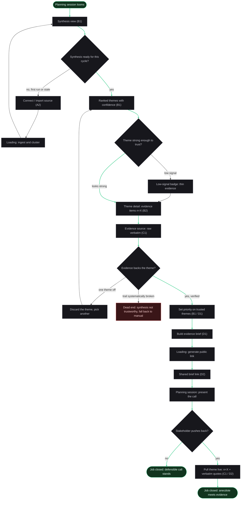
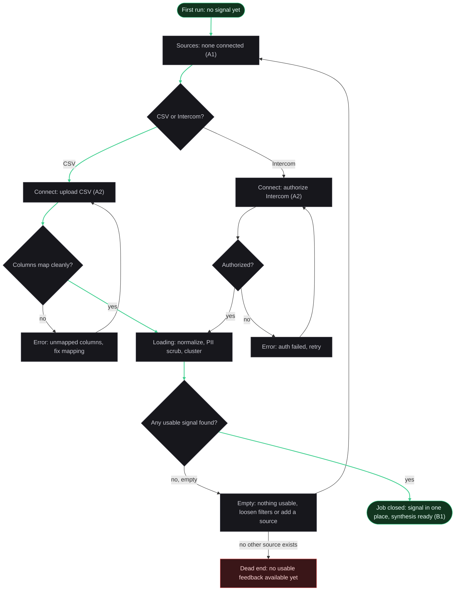
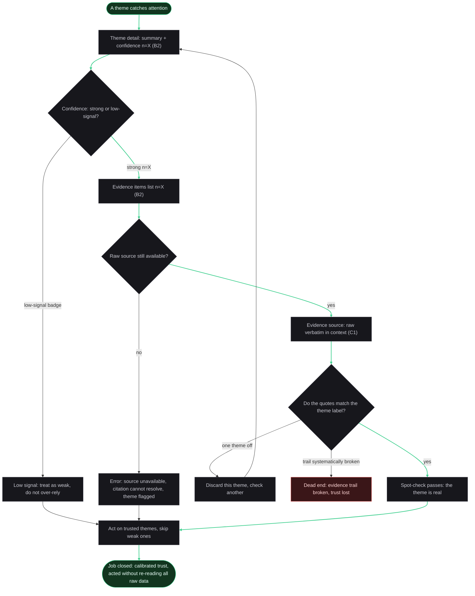
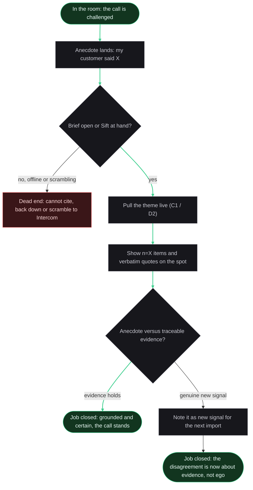
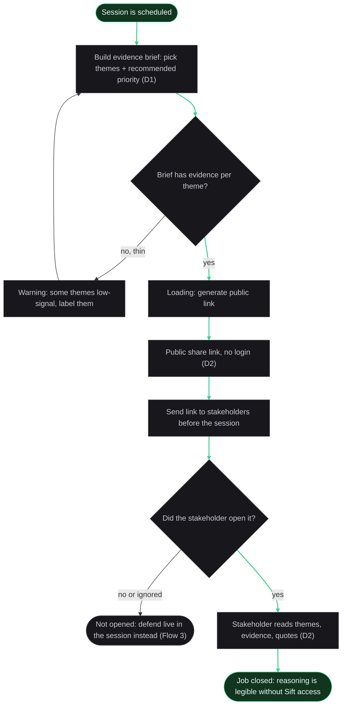

# IA - User Flows (Basic Layer) - Sift

*How the primary persona (Alex, the Overloaded PM) moves through the concept-sitemap screens to close the main job and its related jobs. Each flow traces to the CJM To-Be phases (the route skeleton); As-Is barriers (cjm-as-is.md) appear as decision points and dead-ends, so the flows show where the person can still get stuck, not only the happy path.*

*Every screen-node exists in the concept-sitemap (sitemap.md, section 2). States (empty / error / loading) are separate nodes, not screens. Node labels carry their concept-sitemap code (A1, B2, ...).*

*Critique note (Step 6): the dead-ends were tightened. A single failed theme or an empty source now recovers (discard and continue, or add another source); the terminal red dead-end is reserved for a systematic failure, where the person genuinely cannot reach the goal.*

## Color legend

- **Green (success):** the ends of the happy path (the start and the closed-job finish) and the arrows that lead to a closed job.
- **Red (dead):** a real dead-end, a node with no path to the goal (the As-Is trap, preserved honestly).
- **Gray (neutral):** everything between the ends, including decision diamonds, loading / empty / error states, and recoveries that loop back into the flow.

Colors use the research.html tokens (green #3ecf8e, red #f06060, dark surfaces). Three classDef per diagram: success / dead / neutral. Node color is authoritative; the green arrows (linkStyle) highlight the happy path as a bonus.

---

## Flow 0 - Main job: roadmap-planning synthesis to a defensible call

*Traces To-Be phases 1 to 6. Primary persona. Job: Main (with J2, J3, J1, S1 along the way). The spine that proves the person reaches the outcome.*

**Decisions:** synthesis ready for this cycle (route to ingest if not); theme strong enough to trust (confidence gate, To-Be P3); evidence backs the theme, split into a single theme off (discard and pick another) versus a systematically broken trail (To-Be P4); stakeholder pushes back (To-Be P6).
**States:** Loading during ingest and cluster; Loading during public-link generation; Low-signal badge on thin themes.
**Recovery:** a single theme that fails the spot-check does not end the journey; the PM discards it and picks another, looping back to the ranked themes.
**Dead-end:** the terminal dead-end is reserved for a systematically broken evidence trail, where trust in the whole synthesis collapses and the PM falls back to manual re-reading. That is the one place the To-Be path can still die (H1 fails). A raw source that cannot resolve is shown as an error state in Flow 2.
**Traces:** To-Be P1 (Connect), P2 (Synthesis ready), P3 (confidence gate), P4 (drill, spot-check, set priority), P5 (build and share brief), P6 (defend live). The As-Is P6 dead-end, scrambling back into Intercom mid-conversation, is inverted here into the Defend node.

---

## Flow 1 - Bring the signal in (first-run activation)

*Traces To-Be phases 1 to 2, closes As-Is Phase 2 (siloed channels, GZ4). Primary. The activation path: a first synthesis on the PM own data, from an empty workspace.*

**Decisions:** CSV or Intercom; columns map cleanly (CSV); authorized (Intercom); any usable signal found.
**States:** empty Sources on first run; Loading during normalize, PII scrub, and cluster; two recoverable Errors (unmapped columns, auth failed) that loop back into the connect step.
**Recovery:** an empty source is not terminal; the PM loosens filters or adds another source, looping back to Sources.
**Dead-end:** the true dead-end is only when no usable feedback exists anywhere yet, so there is nothing to synthesize.
**Traces:** To-Be P1 (connect once, CSV + Intercom, D3), P2 (a synthesis is ready). The green line marks the CSV happy path; the Intercom branch is the symmetric path to the same success.

---

## Flow 2 - Trust the synthesis (confidence and spot-check)

*Traces To-Be phases 3 to 4, closes As-Is Phase 4 (distrust of the summary, GZ2, the second differentiator). Primary.*

**Decisions:** confidence strong or low-signal (To-Be P3); raw source still available (traceability guard); do the quotes match the theme label, split into one theme off (discard and check another) versus a systematically broken trail (To-Be P4).
**States:** the low-signal branch is the honest thin-evidence path; a new Error state covers a source that is unavailable and a citation that cannot resolve, in which case the theme is flagged and the PM still reaches a decision on the other themes.
**Recovery:** a single mismatched theme is discarded and the PM checks another.
**Dead-end:** Broken is terminal only for a systematically broken trail, the trust-destruction anti-pattern benchmark.md warns about, kept visible so the design never hides it.
**Traces:** To-Be P3 (confidence) and P4 (spot-check). Closes GZ2: the PM acts without re-reading everything, because the evidence trail is inspectable.

---

## Flow 3 - Defend live under challenge

*Traces To-Be phase 6, closes As-Is Phase 6 (opinion outweighs unciteable evidence, GZ1, the floor at -5, the deepest win). Primary. Job: J1, E2, S1.*

**Decisions:** is the brief open or Sift at hand (the As-Is trap is being caught without it); anecdote versus traceable evidence (evidence holds, or the challenge surfaced a genuine new signal).
**States:** none of loading type here; this flow is a live, in-room interaction.
**Dead-end:** Scramble is the one legitimate terminal here. The PM is offline or without the brief, cannot cite, and backs down. This is the exact As-Is Phase 6 failure (-5), preserved so the design keeps in view what it must prevent (have the brief ready, To-Be P5, so this branch is not taken).
**Traces:** To-Be P6, the +9 inversion. The second success end (Reframe) is honest: sometimes the challenge is right, and the win is that the disagreement moves onto evidence rather than ego. Note: single-item mid-meeting capture is a fast-follow question; for MVP the new signal is simply noted for the next import.

---

## Flow 4 - Share the brief before the session

*Traces To-Be phase 5, closes As-Is Phase 5 (rationale does not land, GZ5). Primary produces, secondary and anonymous stakeholders consume. Job: S1, J4, Main.*

**Decisions:** does the brief have evidence per theme (route back to add or label thin themes); did the stakeholder open it.
**States:** a recoverable Warning when some themes are low-signal (label them, do not hide them); Loading while the public link generates.
**No hard dead-end:** an ignored brief is not terminal. The PM falls back to defending live in the session (Flow 3), so the person is not stuck. The honest limit is that Sift cannot force a reader to open the brief, but the reasoning still gets its moment in the room.
**Traces:** To-Be P5 (walk in with a brief the room can read), the referral artifact (aarrr.md). GZ5 is supporting, and it reuses the same brief that GZ1 needs, so it comes largely for free.

---

## Coverage and honesty summary

- **No new screens.** Every screen-node above already exists in the concept-sitemap (A1, A2, B1, B2, C1, D1, D2). The flows added no screen, so the Step 5 reconciliation of concept-sitemap versus flows is clean. Real-world touchpoints (the planning session, the room) and states (empty / error / loading) are not screens.
- **States present in every flow that has a happy path:** loading (ingest, link generation), empty (no sources, no usable signal), error (CSV mapping, Intercom auth, and a source that cannot resolve a citation), and low-signal / thin warnings.
- **Recoveries versus dead-ends (tightened in Step 6):** a single failed theme (Flow 0, Flow 2) or an empty source (Flow 1) now recovers rather than terminating. The terminal red dead-ends are the honest catastrophic cases: a systematically broken evidence trail (Flow 0, Flow 2, where H1 fails), no usable feedback anywhere (Flow 1), and being caught in the room without the brief (Flow 3). Flow 4 has no hard dead-end: an ignored brief hands off to the live defend.
- **The deepest inversion (Flow 3 / To-Be P6):** the As-Is floor (-5, evidence loses to the HiPPO) becomes the moment the PM is most in control. That is the product core promise, aimed at the phase with the strongest As-Is evidence.
- **[?] carried forward:** in-meeting single-item capture (Flow 3) is fast-follow, not MVP; the new signal is noted for the next import.
